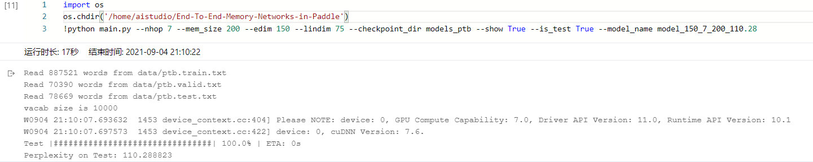
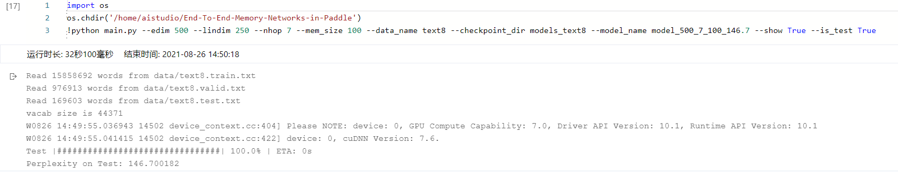

# End-To-End-Memory-Networks-in-Paddle
用Paddle来复现论文End-To-End Memory Networks [End-To-End Memory Networks](https://arxiv.org/pdf/1503.08895v5.pdf)

## 文件结构
```
.
├── checkpoints
├── data
│   ├── ptb.test.txt
│   ├── ptb.train.txt
│   ├── ptb.valid.txt
│   ├── ptb.vocab.txt
│   ├── text8.test.txt
│   ├── text8.train.txt
│   ├── text8.valid.txt
│   └── text8.vocab.txt
├── data.py
├── images
│   ├── ptb.png
│   └── text8.png
├── main.py
├── model.py
├── models_ptb
│   ├── model_150_7_200_115.23
│   └── model_300_8_50_109.86
├── models_text8
│   └── model_500_7_100_146.7
├── README.md
├── requirements.txt
└── utils.py
```

其中：
data文件夹下保存已经处理好的2个数据集(ptb与text8)  
models_ptb保存在ptb数据集上训练的模型，命名格式为`model_edim_nhop_memsize_testppl`,如`model_150_7_200_110.28`表示超参embedding_dim=150,nhop=7,mem_size=200下训练出的模型，模型在test上的perplexity为110.28  
models_text8保存在text8数据集上训练好的模型。  

## 使用
输入`python main.py --help` 将显示如下信息：
```plain
usage: main.py [-h] [--edim EDIM] [--lindim LINDIM] [--nhop NHOP] [--mem_size MEM_SIZE] [--batch_size BATCH_SIZE] [--nepoch NEPOCH]
               [--init_lr INIT_LR] [--init_hid INIT_HID] [--init_std INIT_STD] [--max_grad_norm MAX_GRAD_NORM] [--data_dir DATA_DIR]
               [--checkpoint_dir CHECKPOINT_DIR] [--model_name MODEL_NAME] [--recover_train RECOVER_TRAIN] [--data_name DATA_NAME]
               [--is_test IS_TEST] [--show SHOW]

optional arguments:
  -h, --help            show this help message and exit
  --edim EDIM           internal state dimension [150]
  --lindim LINDIM       linear part of the state [75]
  --nhop NHOP           number of hops [6]
  --mem_size MEM_SIZE   memory size [100]
  --batch_size BATCH_SIZE
                        batch size to use during training [128]
  --nepoch NEPOCH       number of epoch to use during training [100]
  --init_lr INIT_LR     initial learning rate [0.01]
  --init_hid INIT_HID   initial internal state value [0.1]
  --init_std INIT_STD   weight initialization std [0.05]
  --max_grad_norm MAX_GRAD_NORM
                        clip gradients to this norm [50]
  --data_dir DATA_DIR   data directory [data]
  --checkpoint_dir CHECKPOINT_DIR
                        checkpoint directory [checkpoints]
  --model_name MODEL_NAME
                        model name for test [model]
  --recover_train RECOVER_TRAIN
                        if True, load model [model_name] before train [False]
  --data_name DATA_NAME
                        data set name [ptb]
  --is_test IS_TEST     True for testing, False for Training [False]
  --show SHOW           print progress, need progress module [False]
  ```
  其中`--show`选项需要安装progress库。
### 训练
```bash
python main.py --nhop 7 --mem_size 200 --edim 150 --lindim 75 --checkpoint_dir checkpoints --show True
```
### 预测
```bash
python main.py --nhop 7 --mem_size 200 --edim 150 --lindim 75 --checkpoint_dir checkpoints --show True --is_test True
```
### 使用已训练好的模型
```bash
python main.py --nhop 7 --mem_size 200 --edim 150 --lindim 75 --checkpoint_dir models_ptb --show True --is_test True --model_name model_150_7_200_110.28
python main.py --edim 500 --lindim 250 --nhop 7 --mem_size 100 --data_name text8 --checkpoint_dir models_text8 --model_name model_500_7_100_146.7 --show True --is_test True
```
## 性能
在ptb数据集上，使用embedding_dim=150,nhop=7,mem_size=200训练，模型在test上的perplexity为110.28

在text8数据集上，使用embedding_dim=500,nhop=7,mem_size=100训练，模型在test上的perplexity为146.72

