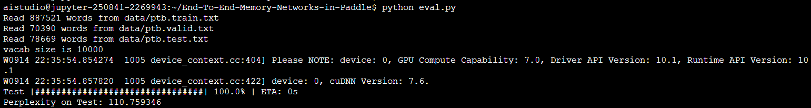
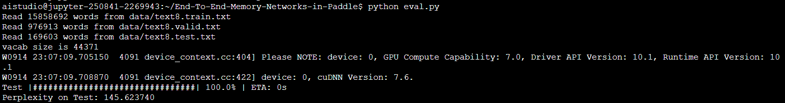

# End-To-End-Memory-Networks-in-Paddle
用Paddle来复现论文End-To-End Memory Networks 

## 模型简介


原论文地址：[End-To-End Memory Networks](https://arxiv.org/pdf/1503.08895v5.pdf)

## 复现结果

| Dataset | Paper Perplexity | Our Perplexity |
| :-----: | :--------------: | :------------: |
|   ptb   |       111        |     110.75     |
|  text8  |       147        |     145.62     |

## 测试

将`config.py`文件的内容替换为`config`文件夹下的`config_ptb_test`中内容。

执行

```bash
python eval.py
```

将得到以下结果



采用`config_text8_test`中的内容即可在text8数据集中进行测试，结果如下



## 训练

训练参数可在`config.py`文件中调整。

Note: 由于本模型受随机因素影响较大，故每次训练的结果差异较大，即使固定随机种子，由于GPU的原因训练结果仍然无法完全一致。

### 在ptb数据集上训练

```bash
python train.py
```
#### 寻找最佳模型

由于模型受随机因素影响较大，故要进行多次训练来找到最优模型，原论文中在ptb数据集上进行了10次训练，并保留了在test集上表现最好的模型。本复现提供了一个脚本，来进行多次训练以获得能达到足够精度的模型。

```bash
python train_until.py --target 111.0
```

以下是在ptb数据集上进行多次训练以达到目标精度的[log](./log/ptb_train_until.log)

### 在text8数据集上训练

将`config.py`文件替换为`config`文件夹下的`config_text8`文件即可。

## 与上一版的区别

1. 调整了代码的整体结构
2. 增加了多次训练达到目标精度的脚本
3. 添加了训练日志